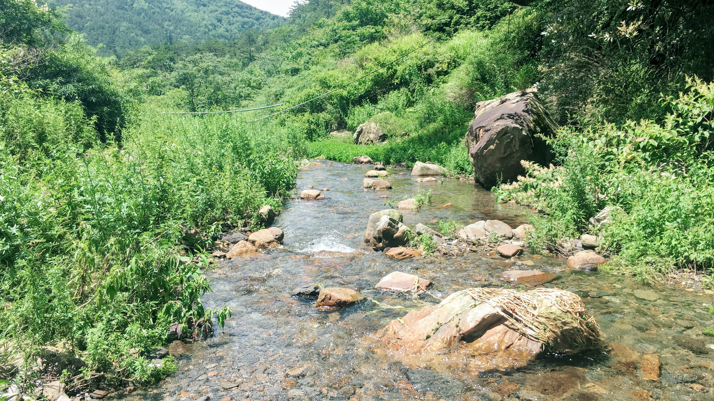
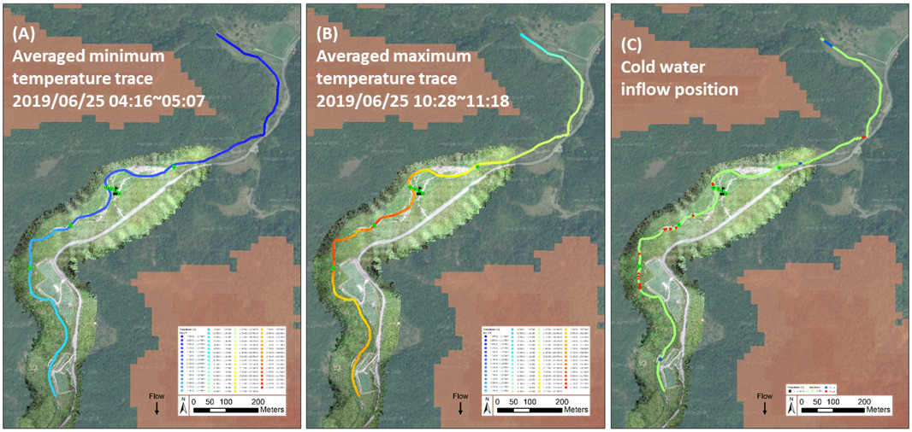

My recent research on the Yousheng River in Taiwan combined fiber-optic distributed temperature sensing, drone imagery, and meteorological data to:

  - Identify and quantify groundwater inputs and hyporheic exchange zones along the river
  - Accurately simulate river temperature dynamics using the HFLUX model
  - Provide insights into how variable groundwater contributions lead to flow disconnections in the intermittent river
  - Inform management strategies for preserving sensitive aquatic habitats like that of the endangered Formosan land-locked salmon

